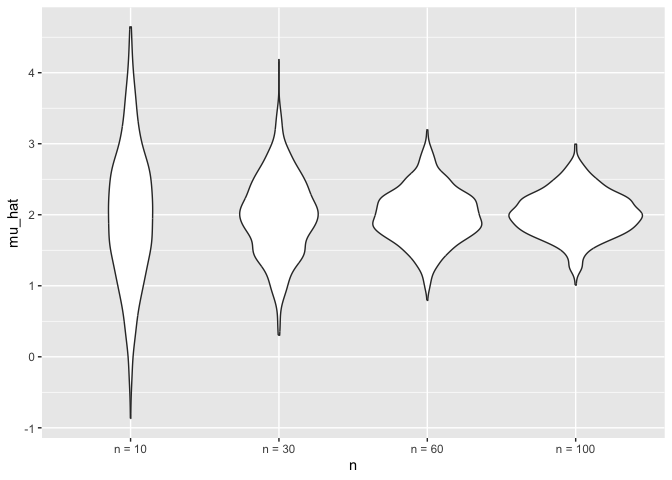
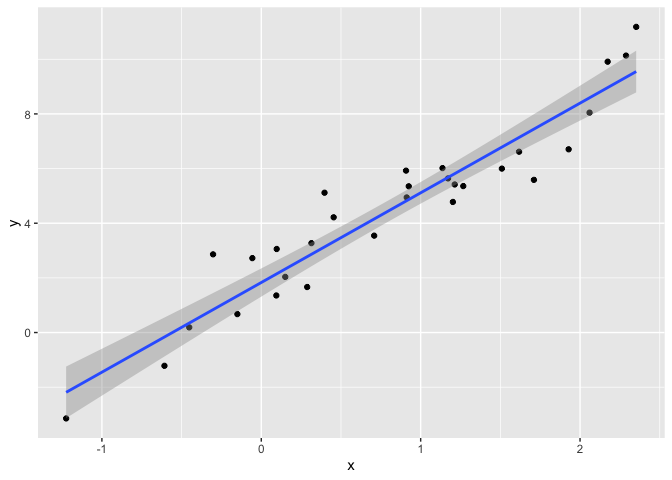
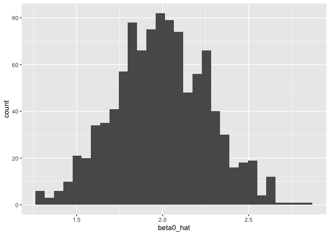
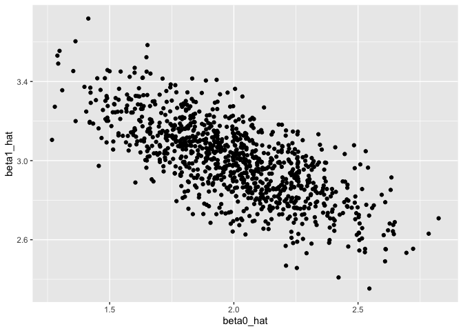
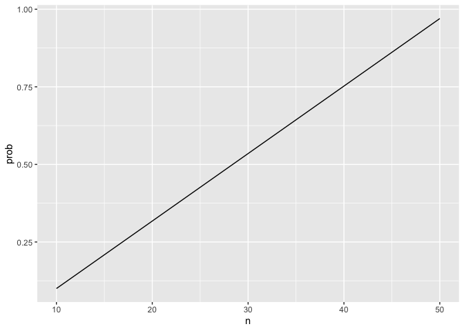

iternation_and_list
================
Congyu Yang
2024-10-29

``` r
sim_mean_sd = function(n, mu = 2, sigma = 3) {
  
  sim_data = tibble(
    x = rnorm(n, mean = mu, sd = sigma),
  )
  
  sim_data |> 
    summarize(
      mu_hat = mean(x),
      sigma_hat = sd(x)
    )
}
```

run this using a for loop

``` r
output = vector("list", 100)

for (i in 1:100) {
  output[[i]] = sim_mean_sd(30)
}

bind_rows(output) %>% 
  summarize(avg_mean = mean(mu_hat),sd_mean = sd(mu_hat))
```

    ## # A tibble: 1 × 2
    ##   avg_mean sd_mean
    ##      <dbl>   <dbl>
    ## 1     1.91   0.561

Can I use map instead?

``` r
sim_res = tibble(iter = 1:100) %>% 
  mutate(samp_res = map(iter,sim_mean_sd,n = 30)) %>% 
  unnest(samp_res)
```

Could I try different sample sizes?

``` r
sim_res <- expand_grid(n = c(10,30,60,100),
                       iter = 1:1000) %>% 
  mutate(samp_res = map(n,sim_mean_sd)) %>% 
   unnest()
```

    ## Warning: `cols` is now required when using `unnest()`.
    ## ℹ Please use `cols = c(samp_res)`.

``` r
sim_res %>% 
  group_by(n) %>% 
  summarize(
    se = sd(mu_hat)
  )
```

    ## # A tibble: 4 × 2
    ##       n    se
    ##   <dbl> <dbl>
    ## 1    10 0.938
    ## 2    30 0.561
    ## 3    60 0.383
    ## 4   100 0.316

``` r
sim_res %>% 
  mutate(
   n = str_c("n = ", n),
   n = fct_inorder(n)) %>% 
  ggplot(aes(x = n,y = mu_hat))+
  geom_violin()
```

<!-- --> \### SLR

``` r
sim_data = 
  tibble(x = rnorm(30,mean = 1, sd =1),
         y = 2 + 3 * x + rnorm(30,0,1))

lm_fit = lm(y ~ x, data = sim_data)

sim_data %>% 
  ggplot(aes(x = x, y = y))+
  geom_point()+
  stat_smooth(method = "lm")
```

    ## `geom_smooth()` using formula = 'y ~ x'

<!-- -->

Turn this into a function

``` r
sim_regression <- function(n){
    sim_data = 
    tibble(x = rnorm(n,mean = 1, sd =1),
           y = 2 + 3 * x + rnorm(n,0,1))
  
  lm_fit = lm(y ~ x, data = sim_data)
  
  out_df = tibble(beta0_hat = coef(lm_fit)[1],
                  beta1_hat = coef(lm_fit)[2])
  return(out_df)
}

sim_res = 
  expand_grid(sample_size = 30,iter = 1:1000) %>% 
  mutate(lm_res = map(sample_size,sim_regression)) %>% 
  unnest()
```

    ## Warning: `cols` is now required when using `unnest()`.
    ## ℹ Please use `cols = c(lm_res)`.

``` r
sim_res %>% 
  ggplot(aes(x = beta0_hat)) +
  geom_histogram()
```

    ## `stat_bin()` using `bins = 30`. Pick better value with `binwidth`.

<!-- -->

``` r
sim_res %>% 
  ggplot(aes(x = beta0_hat,y = beta1_hat)) +
  geom_point()
```

<!-- --> \###
Birthday problem!

``` r
bday_sim = function(n){
  bdays = sample(1:365,size = n,replace = T)
  duplicate = length(unique(bdays)) < n

  return(duplicate)
  }

bday_sim(10)
```

    ## [1] FALSE

run this a lot

``` r
sim_res <- 
  expand_grid(
    n = c(10,50),
    iter = 1:100
  ) %>% 
  mutate(res = map_lgl(n,bday_sim)) %>% 
  group_by(n) %>% 
  summarize(prob = mean(res))

sim_res %>% 
  ggplot(aes(x = n , y = prob))+
  geom_line()
```

<!-- -->
